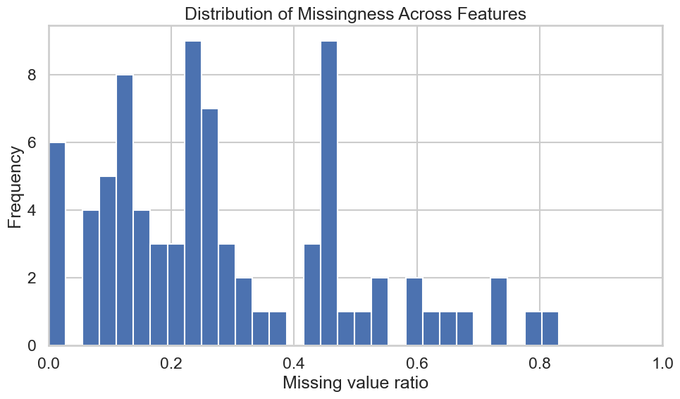
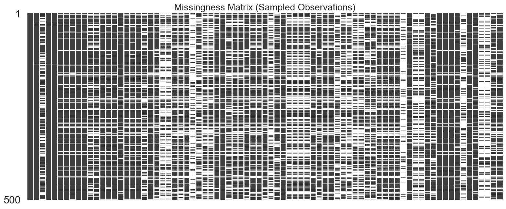
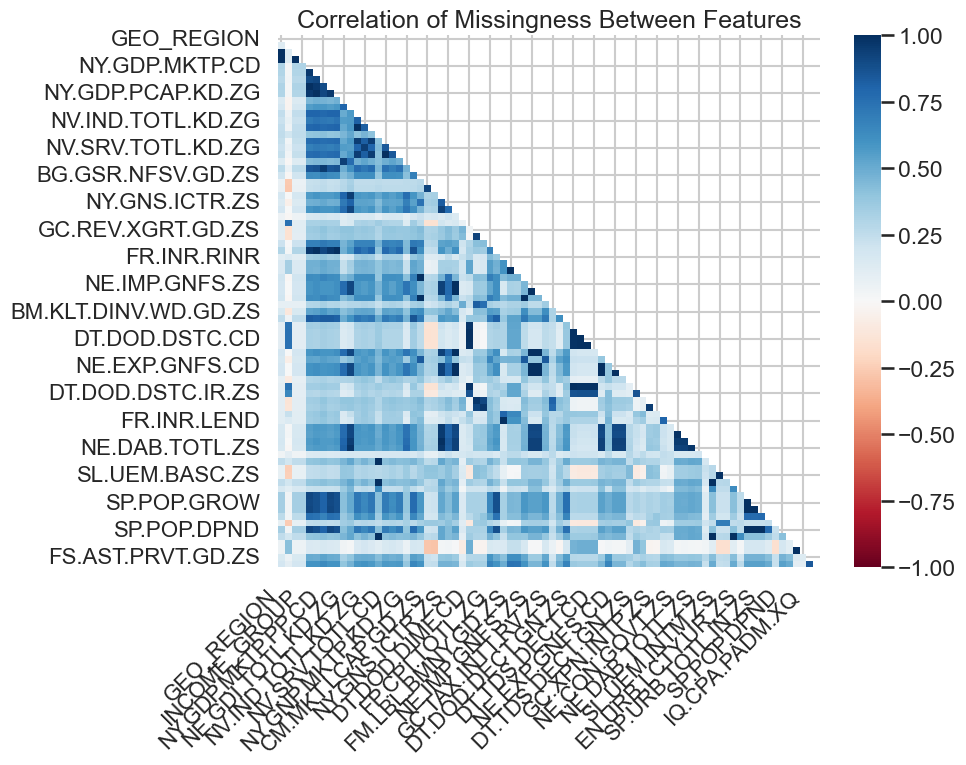
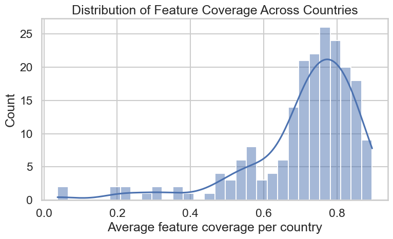
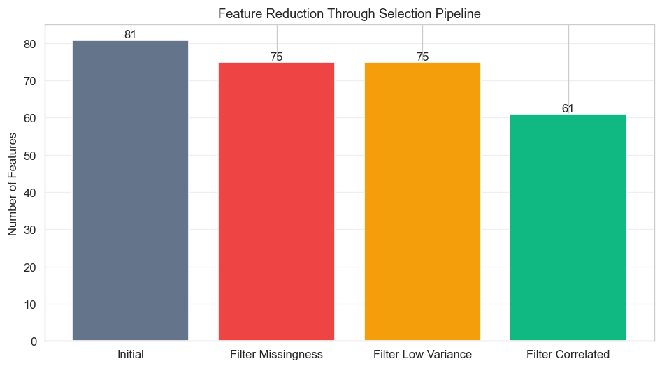
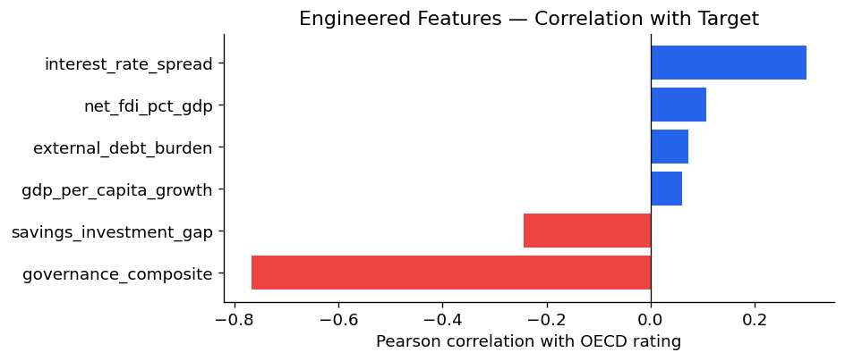
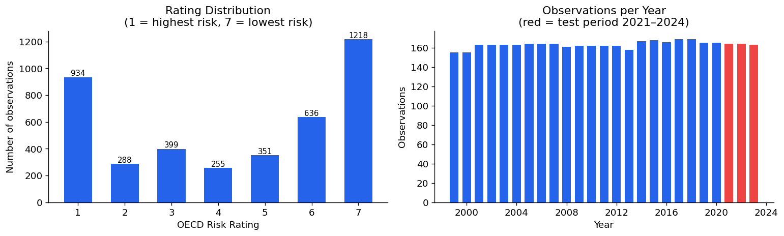

# Data Diagnostics: Dataset Quality and Feature Selection

## Introduction

This report details the data quality assessment and feature selection process for the OECD country risk rating prediction project. The dataset combines OECD sovereign risk ratings with 74 World Bank macroeconomic indicators across multiple economic dimensions. The preprocessing pipeline addresses missingness, stability, and redundancy to produce a robust feature set for modeling.

## Data Quality

### Missingness Patterns

Missing values are pervasive across the dataset, with indicator-level missingness ranging from 0% to over 60%. The distribution of missingness across features is highly skewed:

The missingness matrix reveals systematic gaps in reporting:

Certain countries and years exhibit higher rates of missing data, often reflecting data availability policies of the World Bank or reporting capabilities of individual countries.

Missingness correlation analysis identifies clusters of indicators that share similar reporting patterns:

### Feature Coverage by Country

Feature coverage varies significantly across countries, with OECD members generally having more complete data:

This heterogeneity reflects both data availability and the OECD's focus on member countries in its risk assessments.

## Feature Selection

### Selection Pipeline

The feature selection process applies sequential filters to address data quality concerns:

1. **Missingness Filter**: Excludes features with >60% missing values (81 → 75 columns)
2. **Variance Filter**: Removes low-variance features (no change at threshold 0.001)
3. **Correlation Filter**: Eliminates features with pairwise correlation >0.95 (75 → 61 columns)

The pipeline reduces the initial column set from 81 to 61:

### Engineered Features

Feature engineering creates 5 domain-informed transformations that improve predictive signal:

- **Interest rate spread**: difference between lending and deposit rates
- **GDP per capita growth**: year-over-year change in GDP per capita
- **Net FDI as % of GDP**: foreign direct investment relative to economic size
- **External debt burden**: external debt relative to GNI
- **Savings-investment gap**: difference between gross savings and capital formation

After engineering and removing rows with excessive missing values, the final dataset contains **4,238 observations** across **64 features**.

Correlation analysis of engineered features with the target variable shows enhanced predictive power:

### Final Dataset

- **Observations**: 4,238 country-year pairs
- **Features**: 64 (54 selected indicators + 5 engineered + 5 metadata columns used by the model)
- **Target**: OECD risk ratings (1–7 scale)
- **Temporal range**: 1999–2026

The dataset overview shows the representation across rating categories:

## Conclusion

The feature selection pipeline successfully addresses data quality challenges while preserving predictive information. The resulting dataset provides a solid foundation for temporal model evaluation, with engineered features capturing both current conditions and trends in economic indicators.

## Further Directions

- **Explore alternative missingness imputation strategies** beyond simple imputation, such as multiple imputation or model-based approaches.
- **Investigate country-specific feature subsets** to account for structural differences in economic reporting.
- **Implement stability analysis** over rolling windows to identify features with time-varying predictive power.
- **Consider dimensionality reduction techniques** like PCA or autoencoders for capturing latent economic factors.
