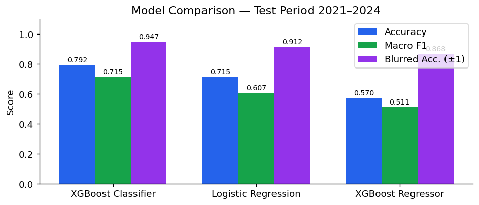
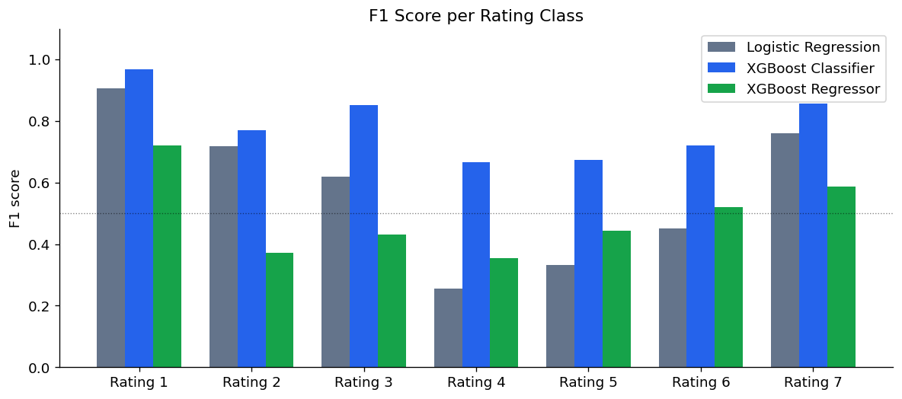
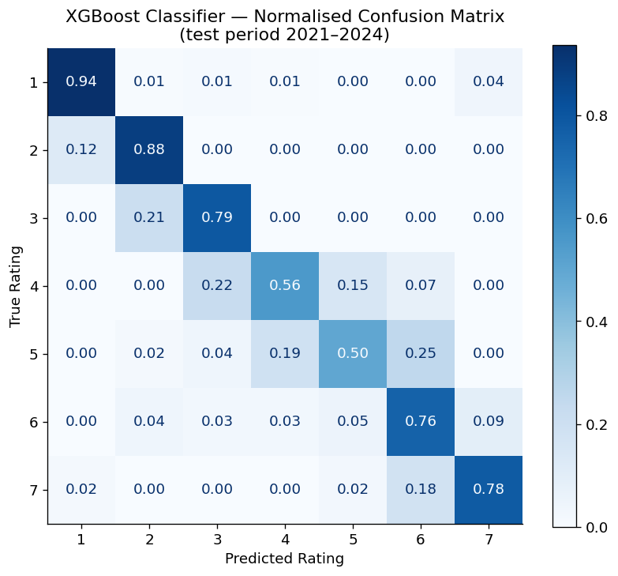
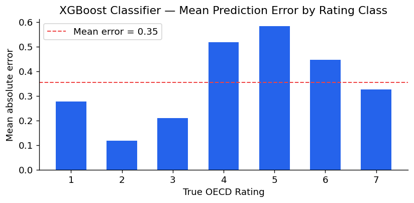
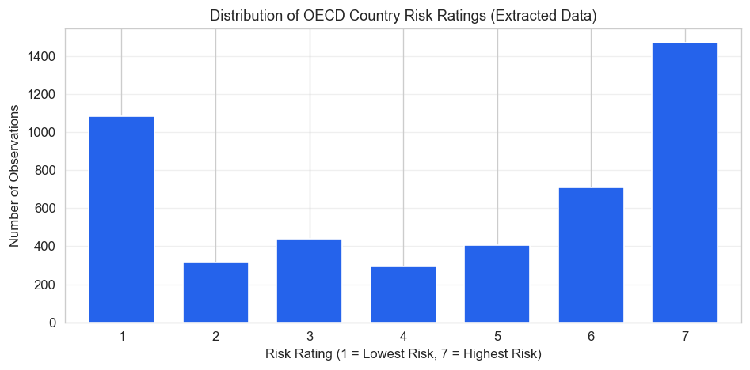
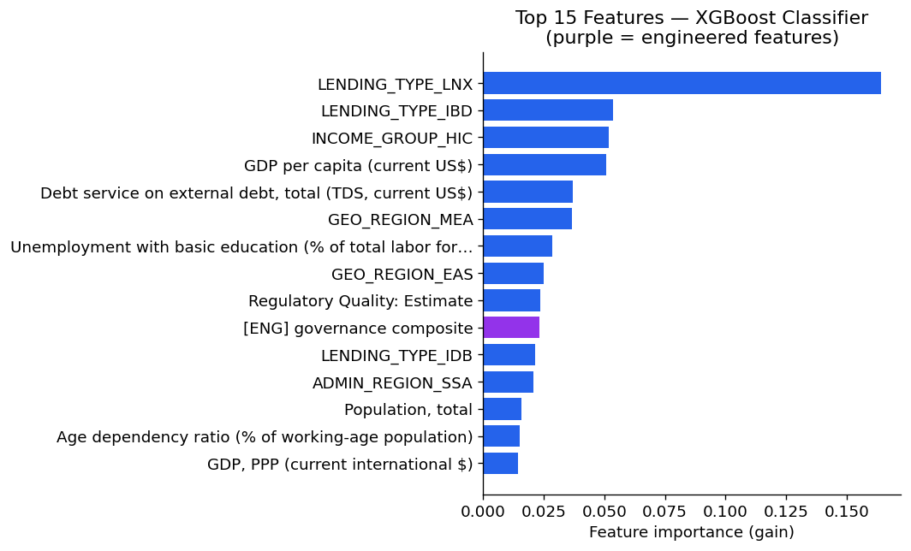
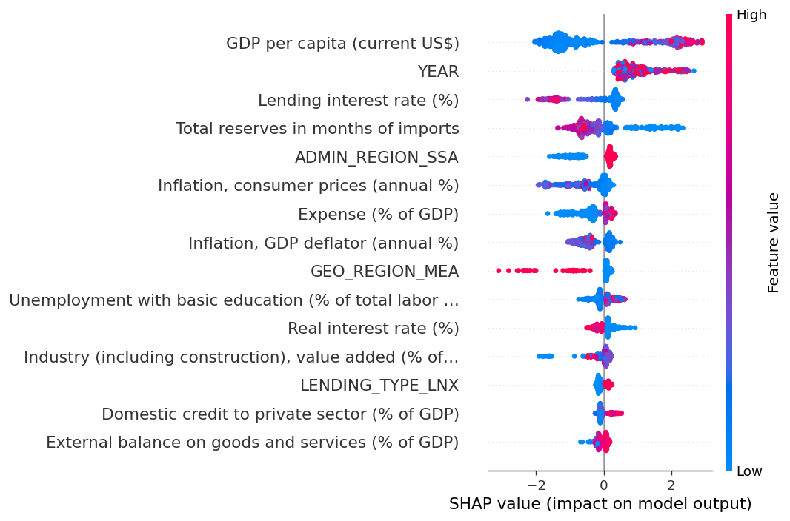
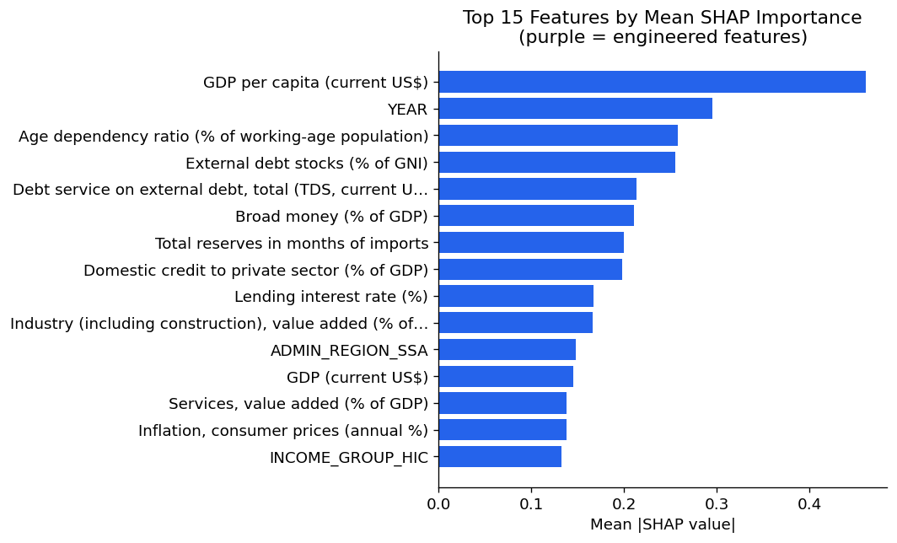
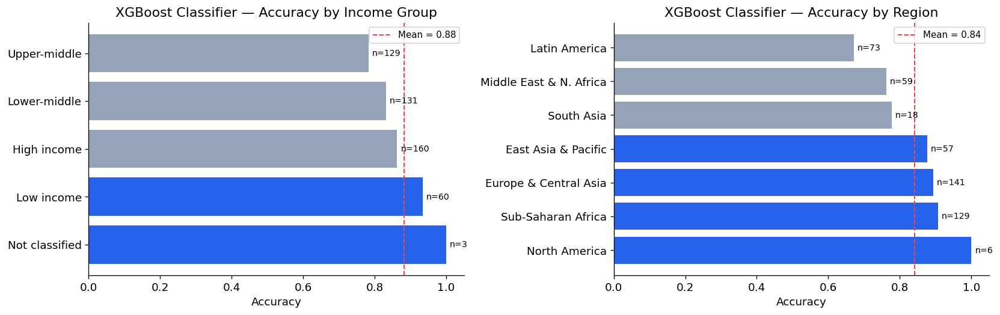

# Model Results: Performance, Interpretation, and Analysis

## Overview

This report presents detailed results from evaluating three models on the temporal test set (2022–2026, 483 observations). For context on the modeling decisions and data pipeline, see the [Executive Summary](Executive_Summary.md) and [Data Diagnostics](Data_Diagnostics.md).

## Aggregate Performance

| Model | Macro F1 | Accuracy | Blurred Accuracy (±1) |
|---|---|---|---|
| Logistic Regression (baseline) | 0.592 | 0.683 | 0.876 |
| XGBoost Regressor | 0.487 | 0.560 | 0.896 |
| **XGBoost Classifier** | **0.761** | **0.812** | **0.917** |

The XGBoost Classifier improves over the logistic regression baseline by +0.169 macro F1 and +13 percentage points accuracy. The gap is driven by mid-range ratings (3–5), where non-linear feature interactions matter most.

## Per-Class Performance

F1 scores vary substantially across rating categories:

| Rating | LR | XGB Classifier | XGB Regressor |
|---|---|---|---|
| 1 (lowest risk) | 0.907 | 0.968 | 0.720 |
| 2 | 0.718 | 0.769 | 0.371 |
| 3 | 0.620 | 0.851 | 0.430 |
| 4 | 0.256 | 0.667 | 0.356 |
| 5 | 0.333 | 0.675 | 0.442 |
| 6 | 0.452 | 0.721 | 0.520 |
| 7 (highest risk) | 0.760 | 0.856 | 0.588 |

The XGBoost Classifier is the only model with no per-class F1 below 0.66. The logistic regression baseline drops below 0.35 for ratings 4 and 5 — the transitional economic zones where non-linear patterns matter most.

## Error Analysis

### Confusion Matrix

The normalized confusion matrix for the XGBoost Classifier shows strong diagonal performance, with most misclassifications occurring between adjacent rating categories:

This is expected for ordinal classification where adjacent ratings reflect similar underlying risk levels.

### Error Distribution by Class

High-rated countries (ratings 6–7) are predicted most reliably, while mid-range ratings (3–5) exhibit higher uncertainty. This reflects the greater economic stability of extreme-rated countries and the transitional nature of mid-range ratings, where small economic changes can trigger rating shifts.

### Rating Distribution Across Splits

The training and test distributions are broadly similar, though the test period (2022–2026) reflects post-pandemic economic conditions that may differ from historical patterns.

## Subgroup Analysis

Performance by income group (XGBoost Classifier):

| Income Group | n | Accuracy | Blurred Acc. (±1) |
|---|---|---|---|
| Low income | 60 | 0.933 | 0.950 |
| High income | 160 | 0.862 | 0.956 |
| Lower-middle | 131 | 0.832 | 0.969 |
| Upper-middle | 129 | 0.783 | 0.961 |

The model performs well across all income groups. Upper-middle-income countries are hardest to classify — these often sit at rating boundaries where small economic shifts trigger rating changes.

## XGBoost Regressor: Median Collapse

The XGBoost Regressor underperforms despite using the same features and split. MSE loss drives predictions toward the centre of the rating distribution, compressing extreme ratings (1 and 7). After rounding to integer classes, this produces many wrong-class predictions at the extremes (hence low F1) while still landing within one step of the true value (hence decent blurred accuracy of 0.896).

This illustrates why classification objectives are better suited than regression for ordinal targets with discrete boundaries.

## Feature Importance and Interpretation

### Global Feature Importance

The most influential predictors align with economic theory of sovereign risk:

Economic growth, fiscal balance, and external debt indicators emerge as the strongest predictors.

### SHAP Analysis

SHAP values reveal how features influence predictions differently across the rating spectrum:

Some features have opposing effects on high versus low ratings — for instance, high GDP per capita pushes predictions toward low risk (rating 1), while low values push toward high risk.

### Accuracy by Feature Category

Performance varies by economic dimension, indicating which types of indicators carry the most predictive signal:

This can guide future data collection and feature engineering priorities.

## Future Directions

- **Alternative data sources**: news sentiment, political stability indices, or market-based indicators (CDS spreads, bond yields) to capture qualitative risk dimensions
- **Ensemble methods**: combining classifier and regressor outputs for improved robustness at class boundaries
- **Probabilistic forecasting**: quantifying prediction uncertainty to enable risk-adjusted decision making
- **Sequence modeling**: leveraging temporal trajectories of indicators rather than point-in-time snapshots
- **Extended validation**: rolling temporal splits to assess model stability across different economic regimes
